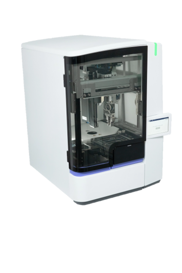
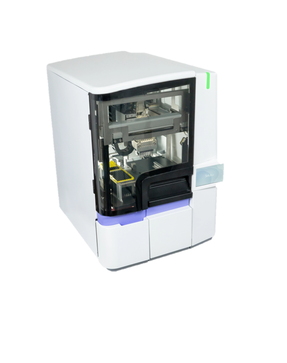

# Selux Diagnostics Automation
A walkthrough of my work with Selux Dx, working on automated blood separation and inoculation systems.
The Selux Dx Systems aim to significantly reduce time to AST results from the current standard. 
This allows for faster, more targeted care of patients, aiming to reduce Sepsis and superbugs.

I worked as an embedded systems programmer and R&D engineer at Selux Dx. 
During this time, I became the lead automation programmer for 2 of the 3 systems: The Separator and the Inoculator.
### Please Note! 
This is an informal review and walkthrough of my work at Selux Diagnostics.
PLEASE see the [Official Selux Website](https://seluxdx.com/)

## Separator
[Official Selux Separator Page](https://seluxdx.com/technology/separator/)

### Overview
The separator inputs 1-2 positive blood samples, isolates the bacteria, and outputs a 
bacterial resuspension of a set McFarland. It uses a Hamilton pipettor, Hettich centrifuge,
Festo gripper, spectrophotometer, and custom sample deck.

Selux automation is done in a custom scripting language, created in C#. When
I first started at Selux, I worked only in the scripting language - creating the 
original happy path script for the Separator. 
In the early days of the Separator, I spent a lot of time working with the microbiologists 
creating custom test scripts to optimize and understand the scientific process.

I expanded the script to handle all failure paths, ensuring samples were cleaned up and capped,
and the UI had clear instructions to the user. As internal usage increased,
I studied top failure modes and worked to increase reliability and throughput.

### The Code

I'd liken the scripting language to Assembler: The hardware APIs were integrated in C#,
and commands ported to simple dropdown options. The original happy path solution was code
that could be "read" through, with each command performing a single function:
moving the gantry, gripping caps or tubes, starting the centrifuge, etc.

As work developed on the Separator, there was a large code rewrite to help with two things:
ease of code editing, and failure path handling. Common routines were divided into methods, and those
methods were error handled. While some error handling can be universal, the physical state
of the components required understanding of the state of the machine to properly clean up. Tracking
the current status of samples, caps, liquid levels was added, allowing for cleanup based on the combination
of all instrument consumable states. Having everything divided into subroutines also allowed for faster
creation of test scripts, by changing out a subroutine and checking the start and end states of all physical components
matched at the beginning and end of that new subroutine. This allowed for rapid development of R&D, testing,
and ideas the microbiologists wanted to test. 

I was the sole developer of this script for around 2 years, and remained the lead script developer.

Originally, the C# codebase was created and updated by a contract manufacturing company. As Selux grew, we wanted more 
control over this code. In my third year at Selux, I joined the new internal software development team, and began working
in C#. Having access to this codebase really opened up so many development possibilities. I had a list of things that the 
developers had said were too time-consuming, difficult, or impossible that I was now able to implement. We sped up the instrument
by over 20%, added new Hamilton pipettor functions, and added better structure and options to the scripting language.
I really loved being able to make changes and immediately test them on an instrument - seeing what worked and what didn't, 
and being able to fix it hands-on. There was also a ton of code clean up that had to be done, which was a great experience
that helped boost my understanding of C#.

### Hardware, Maintenance, and Documentation
My first job as a co-op was installing the first 5 Separators and taking notes on the installation guide. I got a ton
of experience working hands-on with these instruments, from dissecting Hamilton pipettors, to retrofitting new parts, to 
cleaning out centrifuges. These experiences were absolutely integral to my understanding of the Separator and 
my development of the failure handling code. I really loved being in the lab and working with the microbiologists, and felt 
a real passion in making the Separator work as best as possible for my teammates. 

Because I was so involved in the initial run up of this machine, I wrote a lot of the documentation for service procedures,
troubleshooting and fixes, and workflow guides. I also worked with systems engineers on the FMEAs, test cases, and requirements.

As the Field Service Team grew, I stepped back from most maintenance work, but remained a resource for in-field troubleshooting
 and ran weekly log reviews. Because I led the script development, I was able to create an error code system and document, 
so a customer could read out an easily accessible error code to a service technician, who could look it up on the document and
see the likely root cause and fix.

As more systems were deployed, I created a Python tool that scrubbed all instrument logs and created a pareto of top failure modes.
I dived into the logs and created quarterly reports on error causes, trends, and system-specific issues.

## Inoculator

[Official Selux Inoculator Page](https://seluxdx.com/technology/inoculator/)

### Overview

The Inoculator creates, mixes, and distributes different ratios of bacteria and MHB to a
384 well plate. The plate has different dried down drugs in each well, and after the plate incubates, the growth rate of the 
bacteria is tested in each well, allowing for an accurate analysis of what drugs are effective for the patient. The incubation,
plate readings, and analysis are completed on the third instrument in the system suite: the Analyzer. The Inoculator can 
distribute a variety of different ratios and patterns depending on the plate type (Gram positive, Gram Negative, etc).

This Inoculator is a Version 2 of the system, and I worked on the testing, scripting, and optimization during its development.
The original Inoculator was very different, using bulk fluidics, no mixing, and smaller pipette tips. Version 2 was created 
due to the maintenance issues bulk fluidics have, as well as feedback on the longer preparation workflow.

This Inoculator allowed for a very minimal preparation workflow, since all mixing and ratio creation was done on-instrument.

### The Code

The Inoculator was developed while we were still working with an external manufacturing company that also developed our codebase.
While we were still developing via a scripting language, I was able to help shape the scripting language based on the pitfalls
and constraints I had learned from the Separator. This allowed Selux to have a lot more control over the Inoculator scripting, 
and easier ways of testing and optimizing hardware and workflow. The scripting language was still similar to the Separator's,
but allowed for script subroutines, named memory registers, and much more customization in each low level command. 

Having this ownership over the scripting allowed me to do a lot of the initial testing of the Inoculator: Maximum speeds,
path planning ideas, and pipettor optimization were some of the initial studies I worked on to maximize Inoculator performance.
I also got to work with the microbiology and algorithm team to test out and develop and handful of panel layouts.
My favorite part about scripting is the logic, so getting to create and optimize a bunch of different ratios, dispense patterns,
and mixing options was amazing.

The transition to owning the backend C# code happened at the same time as the Separator, which allowed us to change and adapt 
the codebase internally. The effects on the Inoculator were less severe, since the scripting language had been developed 
with this higher ownership in mind.

### Workflow Change Project

One of my favorite projects was a workflow change study I led for a customer in Nebraska. The Inoculator workflow was 
machine-centric: One of the main points of the Inoculator update was to move fluidics mixing from the benchtop preparation 
workflow onto the instrument. However, this lead the instrument time to be longer than the carrier preparation time - customers
who are looking to maximize their throughput would end up waiting for the Inoculator to finish so they could load their next
samples. 

The initial efforts here were on speeding up the inoculator: mixing ~25mL of sample was a large time-suck, so we tested 
consumable changes, mixing speed and movement changes, anything we thought could improve mixing speed. We reduced time 
slightly, but not significantly enough to fix the bottleneck. I also worked on making sure every speed and pipettor setting
was optimized, which again gained a few seconds back per sample, but because this work was done as the instrument was being 
developed, there wasn't much left to optimize.

So, we reached out to customers to better understand their ideal workflow. We worked with a customer in Nebraska who said
she would rather have more hands-on preparation work than stand and wait for a machine to finish, even if it took the same total
time. I worked to develop and sample preparation and Inoculator workflow that would ideally balance out:
A sample should take the same amount of time to prepare at sample prep as it would to finish on the instrument. We worked through
a couple workflow protoypes, and then I lead an internal study. We wanted to compare the time to load 60 samples onto the analyzer
with: 1 or 2 users, 1 or 2 Inoculators, and the old workflow versus the new workflow. It was important to understand
user downtime, and also how consumable replacement on the instrument impacted the sample preparation timings. I observed a 
full day of testing, writing down times to prep, times to replace consumables, downtime, observations on how the workflow looked,
and also interviewed the microbiologists to get their opinions on how the workflow felt. With all this data,
we found a well-balanced workflow that left the user with almost no downtime, and got 60 samples through the system in a 
reduced time. Being able to present and demo the new workflow in front of a real customer was a great experience.
Obviously it was amazing that she loved the new balance of the workflow, but to be able to get live, unfiltered feedback 
and better understand the hospital lab environment was a great experience that helped shaped how I approached R&D work on
the instruments. 
